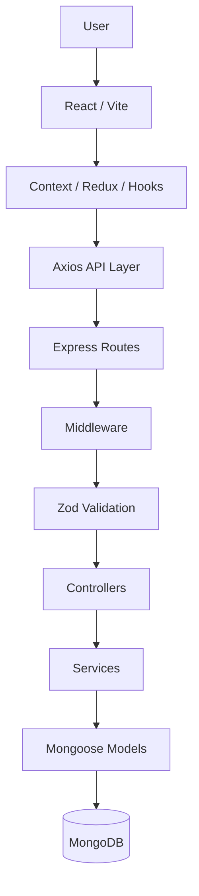
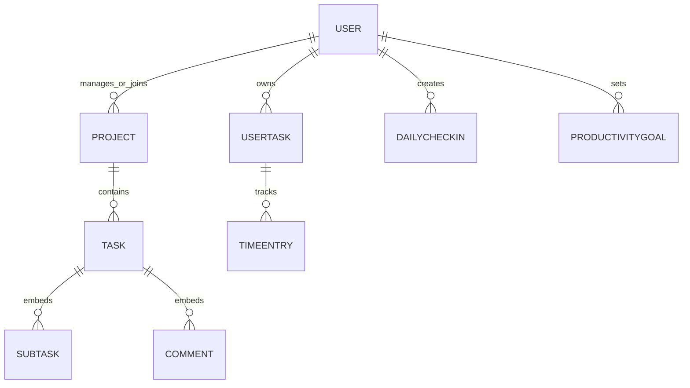

# Time Analysis and Productivity Dashboard

A full-stack productivity and time-analysis application that combines **project management, task tracking, time tracking, and personal productivity analytics** in one platform.

The application helps individuals and teams understand how they spend their time, manage work, track productivity, and identify useful patterns in their daily activities.

---

## Table of Contents

* [Problem Statement](#problem-statement)
* [Solution](#solution)
* [Key Features](#key-features)
* [Technology Stack](#technology-stack)
* [Architecture](#architecture)
* [Request Flow](#request-flow)
* [Authentication](#authentication)
* [Password Reset](#password-reset)
* [Database Design](#database-design)
* [Time Tracking](#time-tracking)
* [Analytics](#analytics)
* [API Overview](#api-overview)
* [Project Structure](#project-structure)
* [Setup](#setup)
* [Environment Variables](#environment-variables)
* [Testing](#testing)
* [Security](#security)
* [Screenshots](#screenshots)
* [Future Improvements](#future-improvements)
* [Known Limitations](#known-limitations)
* [Interview Explanation](#interview-explanation)
* [Important Engineering Decisions](#important-engineering-decisions)

---

# Problem Statement

## What problem does the application solve?

Individuals and teams often use separate tools for managing tasks, tracking time, and understanding productivity.

Traditional task-management tools primarily answer:

> **What needs to be done?**

Time trackers answer:

> **How long did it take?**

This application combines these workflows and adds productivity-oriented information such as **focus scores, interruptions, time allocation, and daily productivity information**.

The goal is to help users understand not only what they worked on, but also how their time was spent.

## Target Users

The application is designed for:

* **Individuals** who want to understand their time usage and productivity.
* **Students** who want to track academic and personal activities.
* **Freelancers** who want to organize projects and track working time.
* **Teams** that need lightweight project and task management.

## Why is productivity analysis useful?

Tracking time and productivity information can help users identify patterns in their work habits.

For example, users can analyze:

* Where their time is being spent.
* Which categories consume the most time.
* How focus varies between work sessions.
* How productivity changes over time.
* How interruptions affect work sessions.

---

# Solution

The application provides a unified platform for project management and personal productivity tracking.

A typical workflow is:

```text
Authenticate
    ↓
Create or join projects
    ↓
Create and manage tasks
    ↓
Create personal productivity tasks
    ↓
Track work using time entries
    ↓
Record focus and interruptions
    ↓
Analyze time and productivity
    ↓
View results through the dashboard
```

---

# Key Features

## Project Management

* Create and manage projects.
* Manage project members.
* Assign tasks to users.
* Track task status.
* Create subtasks.
* Add comments.
* React to comments.
* Manage project priorities and status.

## Personal Productivity

* Create personal tasks.
* Categorize personal tasks.
* Track active work sessions.
* Start and stop timers.
* Record focus scores.
* Record interruption information.
* Create productivity goals.
* Record daily check-ins.

## Time Tracking

* Start a timer for a personal task.
* Store the server-side start timestamp.
* Stop an active timer.
* Calculate duration on the backend.
* Store focus information.
* Store interruption information.
* Make completed time entries available to analytics.

## Analytics

The application provides productivity information based on recorded time entries.

Current analytics include:

* Time allocation.
* Productivity comparisons.
* Focus-score aggregation.
* Time-based comparisons such as current week versus previous week.
* Category-based productivity information.

## Authentication

The application supports:

* Email/password authentication.
* JWT-based authentication.
* Google authentication through Firebase.
* Firebase ID-token verification using Firebase Admin SDK.
* Password recovery using OTP-based verification.

---

# Technology Stack

## Frontend

| Technology     | Purpose                                |
| -------------- | -------------------------------------- |
| React          | User interface                         |
| Vite           | Frontend development/build tooling     |
| JavaScript     | Application development                |
| Redux Toolkit  | Shared application/domain state        |
| Context API    | Authentication and cross-cutting state |
| Axios          | API communication                      |
| React Router   | Client-side routing                    |
| Tailwind CSS   | Styling                                |
| Recharts       | Data visualization                     |
| Lucide React   | Icons                                  |
| React Toastify | Notifications                          |

## Backend

| Technology         | Purpose                             |
| ------------------ | ----------------------------------- |
| Node.js            | Runtime                             |
| Express.js         | REST API                            |
| Zod                | Request validation                  |
| JWT                | Application authentication          |
| Firebase Admin SDK | Firebase token verification         |
| bcrypt             | Password and OTP hashing            |
| Multer             | File upload handling                |
| Cloudinary         | Image/file storage where configured |

## Database

| Technology | Purpose                   |
| ---------- | ------------------------- |
| MongoDB    | Database                  |
| Mongoose   | ODM and schema management |

## Testing

| Technology            | Purpose                           |
| --------------------- | --------------------------------- |
| Vitest                | Test framework                    |
| Supertest             | HTTP/API testing                  |
| mongodb-memory-server | Isolated MongoDB test environment |

---

# Architecture

The application follows a client-server architecture.



## Frontend Architecture

The frontend uses a combination of state-management approaches.

### Context API

Used for cross-cutting state such as:

* Authentication.
* Theme-related state where applicable.

### Redux Toolkit

Used for more complex shared application state, particularly project-related data.

### Local Component State

Used for UI-specific state that does not need to be shared globally.

### API Layer

The frontend contains a centralized Axios configuration responsible for common API behavior such as authentication-token handling and response handling.

---

# Backend Architecture

The backend follows a layered structure:

```text
Routes
   ↓
Middleware
   ↓
Validation
   ↓
Controllers
   ↓
Services
   ↓
Models
   ↓
MongoDB
```

### Routes

Define API endpoints and connect them with the appropriate middleware and controllers.

### Middleware

Handles cross-cutting concerns such as:

* Authentication.
* Validation.
* Rate limiting.
* Error handling.
* Authorization where applicable.

### Validators

Zod schemas validate incoming request data before it reaches business logic.

### Controllers

Controllers handle HTTP-level concerns:

* Reading request data.
* Calling business logic.
* Returning HTTP responses.

### Services

Services contain reusable business logic that should remain separate from HTTP-specific controller code.

### Models

Mongoose models define:

* Database schemas.
* Validation constraints.
* Relationships/references.
* Indexes.
* Timestamps and other schema behavior.

### Error Handling

The backend uses centralized error handling to provide consistent API errors and avoid exposing unnecessary internal implementation details.

---

# Request Flow

A typical protected API request follows this flow:

```text
HTTP Request
     ↓
Express Route
     ↓
Authentication Middleware
     ↓
Validation Middleware
     ↓
Controller
     ↓
Service
     ↓
Mongoose Model
     ↓
MongoDB
     ↓
HTTP Response
```

For example, when creating a project:

```text
POST /api/project
        ↓
Authentication
        ↓
Zod validation
        ↓
Project Controller
        ↓
Project business logic
        ↓
Project Model
        ↓
MongoDB
        ↓
201 / appropriate response
```

This separation prevents controllers from becoming responsible for every part of the application's business logic.

---

# Authentication

## Email / Password Authentication

The local authentication flow is:

```text
User
  ↓
Signup/Login Request
  ↓
Request Validation
  ↓
Password Hash Verification
  ↓
JWT Generation
  ↓
Frontend
  ↓
Authenticated API Requests
  ↓
JWT Verification Middleware
```

Passwords are hashed using `bcrypt`.

The backend generates an application JWT after successful authentication.

The frontend sends the JWT with protected API requests.

---

## Google / Firebase Authentication

The Google authentication flow is:

```text
Google
   ↓
Firebase Authentication
   ↓
Firebase ID Token
   ↓
Frontend
   ↓
Backend Google Login Endpoint
   ↓
Firebase Admin SDK
   ↓
Verified Firebase Identity
   ↓
Find/Create Application User
   ↓
Application JWT
```

The backend does not simply trust the Firebase token received from the client. It verifies the token using the Firebase Admin SDK before using the authenticated identity.

---

# Password Reset

The password-reset flow uses an OTP-based mechanism.

```text
Forgot Password
      ↓
OTP Generation
      ↓
OTP Hashing
      ↓
Expiration Information
      ↓
Email Delivery
      ↓
OTP Verification
      ↓
Password Update
      ↓
OTP Cleared
```

The reset credential is not stored as plain text.

The OTP is hashed before being stored and is cleared after successful password recovery to prevent reuse.

---

# Database Design

The application uses **MongoDB with Mongoose**.

## Major Active Models

### User

Stores:

* User identity.
* Authentication-related information.
* Profile information.
* Avatar information where applicable.

### Project

Represents collaborative project spaces and contains project-member information.

### Task

Represents project-level tasks.

Tasks can contain embedded:

* Subtasks.
* Comments.
* Related task information.

### UserTask

Represents personal productivity tasks.

### TimeEntry

Represents tracked work sessions.

Time entries contain information such as:

* User.
* Personal task.
* Start timestamp.
* End timestamp.
* Duration.
* Focus score.
* Interruption information.
* Status.

### DailyCheckIn

Stores daily productivity/check-in information such as mood, energy, and priorities.

### ProductivityGoal

Stores user productivity goals over supported time periods.

---

# Database Relationship Diagram

The following diagram represents the major relationships at a conceptual level:



### Embedded Documents

Subtasks and comments are represented as embedded data within the Task document rather than independent top-level collections.

This keeps task-related information together and avoids introducing unnecessary separate collections for data that belongs directly to a task.

---

# Time Tracking

Time tracking is one of the core features of the application.

## Start Timer

The frontend sends a request to start a timer.

```text
POST /api/time-entries/start
```

The backend creates an active `TimeEntry` and records the start timestamp.

## Active Timer

The frontend displays the running timer to the user.

The backend stores the authoritative timestamp.

## Stop Timer

The frontend requests that the time entry be stopped.

```text
PUT /api/time-entries/:id/stop
```

The backend:

1. Finds the active time entry.
2. Records the end timestamp.
3. Calculates the duration.
4. Stores focus information where supplied.
5. Stores interruption information where supplied.
6. Marks the entry as completed.
7. Saves the time entry.

Conceptually:

```text
Start
  ↓
startTimestamp
  ↓
Active TimeEntry
  ↓
Stop
  ↓
endTimestamp
  ↓
Duration Calculation
  ↓
Completed TimeEntry
  ↓
Analytics
```

### Why calculate duration on the backend?

The server should be the authoritative source for time calculations.

Instead of trusting a client-provided duration:

```text
Client
   ↓
start request

Server
   ↓
records startTimestamp

Client
   ↓
stop request

Server
   ↓
records endTimestamp
   ↓
calculates duration
```

This reduces the opportunity for incorrect client-side duration values.

---

# Analytics

Analytics are generated from recorded productivity data, particularly completed time entries and their associated personal tasks.

## Data Sources

The analytics layer uses information such as:

* Completed TimeEntry records.
* UserTask information.
* Duration.
* Task categories.
* Focus scores.
* Date ranges.

## Time Allocation

Time entries can be grouped according to the category associated with the personal task.

This allows the dashboard to show how tracked time is distributed across categories.

Conceptually:

```text
Time Entries
     ↓
Date Filtering
     ↓
Task / Category Information
     ↓
Duration Aggregation
     ↓
Analytics Response
     ↓
Dashboard Visualization
```

## Date-Based Analysis

The application supports date-based comparisons, including comparisons such as:

```text
Current Week
     vs.
Previous Week
```

Date filtering is performed using the stored timestamps and appropriate database query conditions.

## Focus Analysis

Completed time entries can contain focus scores.

These values can be aggregated to provide an overview of focus during tracked work sessions.

---

# API Overview

The following is a high-level overview of important API areas.

> Endpoint names should always be treated as implementation-specific and should be kept synchronized with the backend route definitions.

## Authentication

| Method | Endpoint                    | Purpose                       |
| ------ | --------------------------- | ----------------------------- |
| POST   | `/api/auth/signup`          | Register a user               |
| POST   | `/api/auth/login`           | Authenticate a user           |
| POST   | `/api/auth/google-login`    | Authenticate through Firebase |
| POST   | `/api/auth/forgot-password` | Start password recovery       |

## Projects

| Method | Endpoint                   | Purpose                       |
| ------ | -------------------------- | ----------------------------- |
| POST   | `/api/project`             | Create a project              |
| GET    | `/api/project/:id`         | Retrieve project details      |
| POST   | `/api/project/:id/members` | Manage/invite project members |

## Tasks

| Method | Endpoint                  | Purpose               |
| ------ | ------------------------- | --------------------- |
| POST   | `/api/tasks`              | Create a project task |
| POST   | `/api/tasks/:id/subtasks` | Add a subtask         |

## Personal Tasks

| Method | Endpoint          | Purpose                |
| ------ | ----------------- | ---------------------- |
| POST   | `/api/user-tasks` | Create a personal task |

## Time Tracking

| Method | Endpoint                     | Purpose                             |
| ------ | ---------------------------- | ----------------------------------- |
| POST   | `/api/time-entries/start`    | Start a timer                       |
| PUT    | `/api/time-entries/:id/stop` | Stop a timer and calculate duration |

## Additional API Areas

The backend also contains API functionality related to:

* Profile management.
* Project management.
* Personal tasks.
* Time entries.
* Productivity goals.
* Daily check-ins.
* File uploads.
* Analytics.

The complete endpoint inventory should be maintained directly from the current Express route definitions rather than manually duplicating every route in the README.

---

# Project Structure

```text
Time-Analysis-and-Productivity/
│
├── client/
│   ├── src/
│   │   ├── components/
│   │   ├── context/
│   │   ├── hooks/
│   │   ├── pages/
│   │   ├── redux/
│   │   ├── config/
│   │   └── ...
│   │
│   └── package.json
│
├── server/
│   ├── config/
│   ├── controllers/
│   ├── middleware/
│   ├── models/
│   ├── routes/
│   ├── services/
│   ├── validators/
│   ├── utils/
│   ├── tests/
│   ├── app.js
│   └── package.json
│
└── README.md
```

## Backend Directory Responsibilities

| Directory      | Responsibility                                    |
| -------------- | ------------------------------------------------- |
| `config/`      | Database and external-service configuration       |
| `controllers/` | HTTP request/response handling                    |
| `middleware/`  | Authentication, validation, rate limiting, errors |
| `models/`      | Mongoose schemas                                  |
| `routes/`      | API route definitions                             |
| `services/`    | Business logic                                    |
| `validators/`  | Zod validation schemas                            |
| `utils/`       | Reusable utility functions                        |
| `tests/`       | Automated tests                                   |

---

# Setup

## Prerequisites

Install:

* Node.js
* MongoDB or MongoDB Atlas
* Firebase project if Google authentication is enabled
* Cloudinary account if image upload functionality is configured
* Required email service configuration if password-reset email functionality is enabled

---

## Clone the Repository

```bash
git clone <repository-url>

cd Time-Analysis-and-Productivity
```

---

## Backend Setup

```bash
cd server

npm install
```

Configure the backend environment variables.

Then start the development server:

```bash
npm run dev
```

---

## Frontend Setup

Open another terminal:

```bash
cd client

npm install

npm run dev
```

The frontend will connect to the configured backend API.

---

# Environment Variables

Never commit real credentials to the repository.

## Backend

Create:

```text
server/.env
```

Use the variable names required by the current backend configuration.

Typical variables include:

```env
PORT=
FRONTEND_URL=
MONGO_URI=
JWT_SECRET=

FIREBASE_PROJECT_ID=
FIREBASE_CLIENT_EMAIL=
FIREBASE_PRIVATE_KEY=

CLOUD_NAME=
CLOUD_API_KEY=
CLOUD_API_SECRET=

EMAILJS_SERVICE_ID=
EMAILJS_TEMPLATE_ID=
EMAILJS_PUBLIC_KEY=
EMAILJS_PRIVATE_KEY=
```

## Frontend

Create:

```text
client/.env
```

Example variable names include:

```env
VITE_API_URL=

VITE_FIREBASE_API_KEY=
VITE_FIREBASE_AUTH_DOMAIN=
VITE_FIREBASE_PROJECT_ID=
VITE_FIREBASE_APP_ID=
```

### Security

Never place real:

* passwords
* JWT secrets
* Firebase private keys
* Cloudinary secrets
* email credentials
* database credentials

inside the README or source repository.

---

# Testing

The backend uses an isolated integration-testing setup based on:

* Vitest
* Supertest
* MongoDB Memory Server

MongoDB Memory Server provides a temporary MongoDB environment for tests so the test suite does not need to use the application's normal database.

## Test Coverage

The current test suite covers important backend flows including:

* Authentication.
* Password reset.
* Projects.
* Tasks.
* Time tracking.
* Analytics.

The latest verified test run contains:

```text
6 test files
23 tests
23 passed
0 failed
```

Current coverage is approximately:

```text
Statements: 37.53%
Branches:   49.12%
Functions:  22.10%
Lines:      37.53%
```

Coverage is intentionally not treated as the only measure of test quality. Some lower-priority endpoints and external integrations still require additional automated testing.

## Run Tests

From the backend directory:

```bash
npm test
```

Run coverage:

```bash
npm run test:coverage
```

---

# Security

The application implements multiple security layers.

## Input Validation

Zod validation is applied at the API boundary to validate incoming request data before it reaches business logic.

## Authentication

Protected APIs use authentication middleware to verify the user's identity.

## Password Hashing

Passwords are hashed using `bcrypt`.

Password-reset OTP information is also protected rather than stored as plain text.

## Rate Limiting

Authentication and password-reset-related endpoints use rate limiting to reduce brute-force and abuse risks.

## JWT Security

JWTs are used for application authentication and are verified by backend middleware before protected operations are performed.

## Firebase Token Verification

Firebase ID tokens are verified on the backend using Firebase Admin SDK rather than trusting the client-provided identity.

## Centralized Error Handling

The backend uses centralized error handling to avoid exposing unnecessary internal implementation details such as database errors or server stack traces to clients.

## Sensitive Logging

Sensitive authentication information and unnecessary user-data logging are not intentionally exposed through debugging logs.

---

# Screenshots

Add actual screenshots here when available.

Recommended screenshots:

### Dashboard

```text
[Add dashboard screenshot here]
```

### Project Management

```text
[Add project/task management screenshot here]
```

### Time Tracking

```text
[Add active time-tracking screenshot here]
```

### Analytics

```text
[Add productivity analytics screenshot here]
```

---

# Future Improvements

The following are realistic improvements based on the current implementation.

## 1. Expanded Automated Test Coverage

Increase coverage for areas such as:

* Firebase authentication.
* Cloudinary integration.
* Upload routes.
* Productivity goals.
* Daily check-ins.
* More analytics edge cases.

## 2. Timezone Handling

Improve timezone handling for users whose local timezone changes or differs from the server's timezone.

This is particularly important for daily check-ins and date-based productivity calculations.

## 3. Concurrent Timer Protection

Strengthen the protection against a user accidentally starting multiple active time entries simultaneously from different devices or browser sessions.

## 4. Real-Time Collaboration

A future version could introduce WebSockets for real-time updates to collaborative project data and comments.

## 5. Analytics Improvements

Future analytics could provide more detailed productivity trends and additional insights while preserving the reliability of the underlying time-entry data.

---

# Known Limitations

The current implementation has several areas that can be improved.

### External Integration Testing

Firebase authentication and Cloudinary uploads do not currently have the same level of automated coverage as the core application flows.

### Productivity Goal UI Integration

Some productivity-goal backend functionality may require additional frontend integration to provide a complete end-to-end experience.

### Timezone Edge Cases

Date-based productivity calculations can require additional timezone-aware handling.

### Concurrent Timers

The application can be further strengthened against simultaneous active timers created from multiple devices or sessions.

### Test Coverage

The overall coverage percentage is currently moderate, with additional testing still useful for lower-covered routes and integrations.

---

# How I Explain This Project in an Interview

> “I built a full-stack Time Analysis and Productivity application using React, Node.js, Express, and MongoDB. The main idea was to combine project management with personal productivity and time tracking.
>
> Users can create projects and tasks, manage personal tasks, start and stop time entries, record focus and interruptions, and view productivity analytics.
>
> On the frontend, I used React with Context API for authentication and cross-cutting state, and Redux Toolkit for more complex shared project state. On the backend, I followed a layered architecture with routes, middleware, Zod validation, controllers, services, and Mongoose models.
>
> One important design decision was calculating time-entry duration on the backend instead of trusting the client. When a timer starts, the server records the start timestamp, and when it stops, the server records the end timestamp and calculates the duration.
>
> I also implemented JWT authentication, Firebase-based Google authentication, input validation, rate limiting, password hashing, and centralized error handling.
>
> For testing, I used Vitest, Supertest, and MongoDB Memory Server so the important backend flows can be tested against an isolated database.”

---

# Important Engineering Decisions

## 1. Zod Validation Middleware

Validation is handled at the API boundary rather than being scattered throughout controllers.

```text
Request
   ↓
Zod Validation
   ↓
Controller
   ↓
Business Logic
```

This keeps invalid input away from the business logic and database layer.

---

## 2. Controller / Service Separation

Controllers are responsible primarily for HTTP-level concerns, while reusable business logic can be placed inside services.

This makes the backend easier to maintain and keeps controllers from becoming unnecessarily large.

---

## 3. MongoDB Memory Server for Testing

The test suite uses MongoDB Memory Server to provide an isolated temporary MongoDB environment.

This reduces the risk of tests modifying normal development or production databases.

---

## 4. Server-Side Duration Calculation

Time-entry duration is calculated using server-side timestamps rather than relying on a duration supplied by the client.

This gives the backend authoritative control over the recorded work duration.

---

## 5. Embedded Subtasks and Comments

Subtasks and comments are embedded within the Task document because they belong directly to the task.

This keeps closely related task data together and avoids introducing unnecessary independent collections for these embedded structures.

---

# Project Status

The project has gone through multiple engineering phases covering:

```text
Authentication & Security
        ↓
Validation & Rate Limiting
        ↓
Backend Architecture
        ↓
Database Architecture
        ↓
Frontend Architecture
        ↓
Time Tracking & Analytics
        ↓
Automated Testing
        ↓
Code Cleanup
        ↓
Professional Documentation
```

The current implementation provides the core project-management, productivity, time-tracking, analytics, and authentication workflows, while several areas remain available for future improvements.

---

# License

Add the project's actual license information here if a license has been selected.

If the repository does not currently contain a license, do not claim one.

---

## Developed With

Built with a focus on:

* Clean architecture
* Secure authentication
* Input validation
* Maintainable backend design
* Reliable time tracking
* Practical productivity analytics
* Automated testing
